Base: 
- 前端：8080
- 后端：8081

1. 用户登录：
- 前端：/login
- 后端表单接收：http://localhost:8081/login
  + "?email=" + this.ruleForm.email
  + "&password=" + this.ruleForm.password
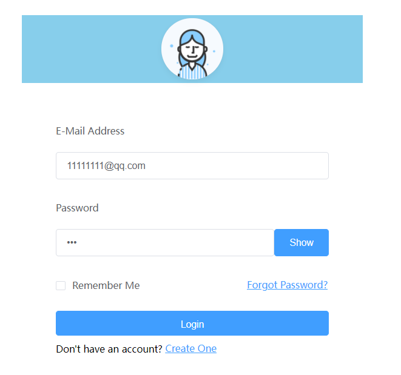
可以选择密码是否可见

2. 注册：
- 前端：/user/register
- 后端: /user/register' + "?username=" + this.ruleForm.username
  + "&email=" + this.ruleForm.email
  + "&password=" + this.ruleForm.password
  + "&gender=" + this.ruleForm.gender
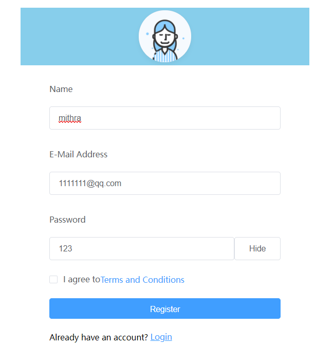
会对邮箱格式、密码、用户名格式（全英文）要求，是否勾选同意Terms and Conditions 进行检测
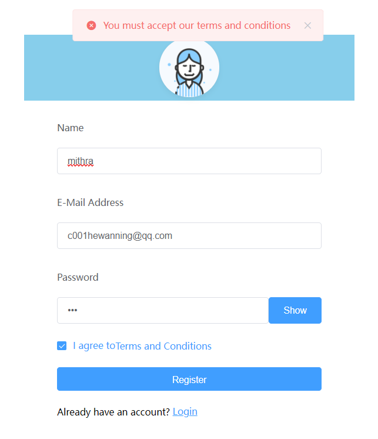
    (未勾选的错误提示)
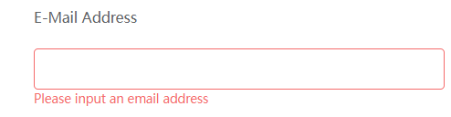
    (邮箱未填写的提示)
填写完成后跳转到登陆界面，并提示前往邮箱激活

3. 忘记密码
- 前端：/login/forgot
- 后端：'http://localhost:8081/login/forgot'
  + "?email=" + this.ruleForm.email,
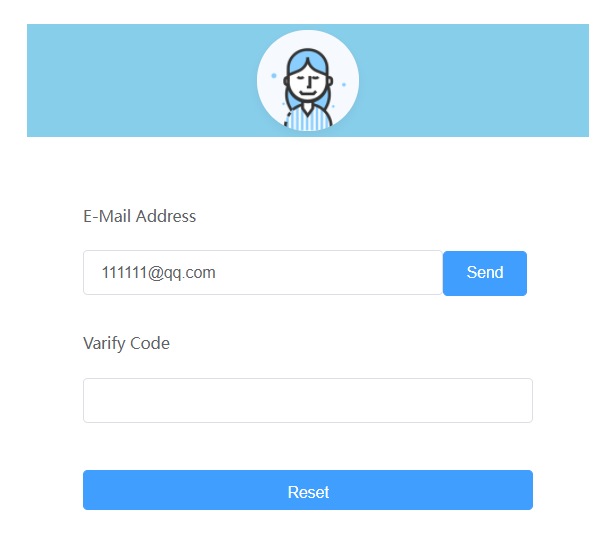 点击send发送验证码
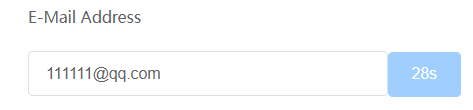

4. 密码重设
- 前端：/login/reset
- 后端：'http://localhost:8081/login/reset'
  + "?password=" + this.ruleForm.password,
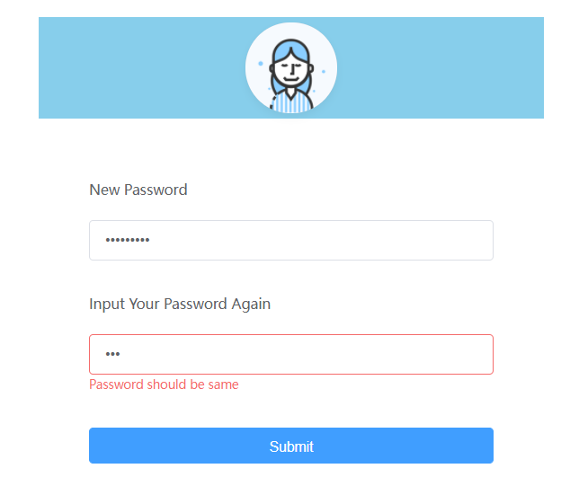
会判断两次输入是否正确

5. 账号激活
- 前端：/user/activate?{activateCode}
- 后端：/user/activate/{activateCode}
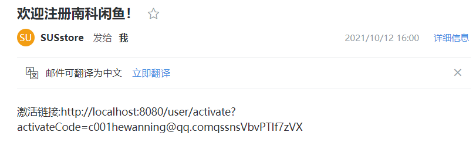
点开邮箱链接激活账号

  (激活成功的提示)

6. 商品详情
- 前端：/goods/:goodsId
- 后端：'http://localhost:8081/goods/' + goodsId
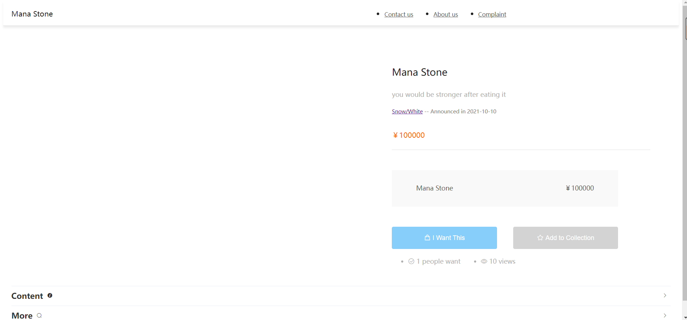
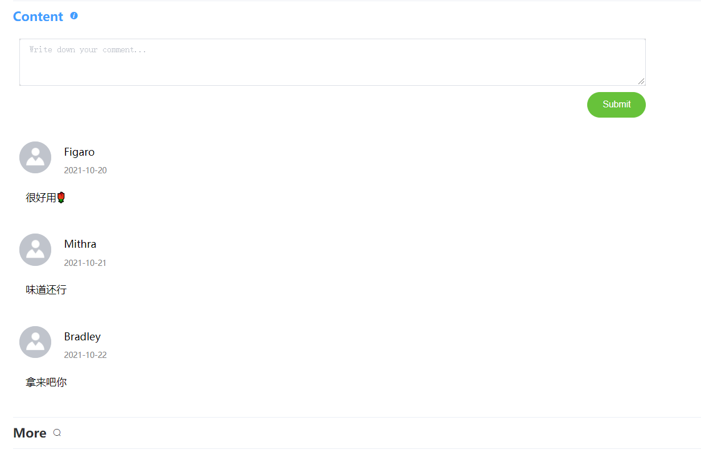
可以添加评论
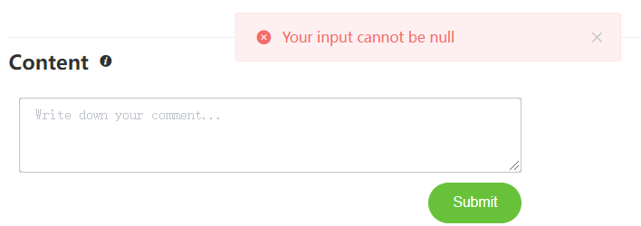
添加成功后加入到评论区中
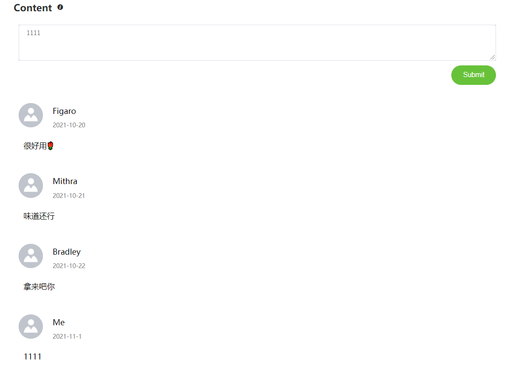

7. 用户收藏夹
- 前端：/collection/:userId
- 后端："http://localhost:8081/collection/" + userId

8. 点击下单后确认界面
- 前端：/deal
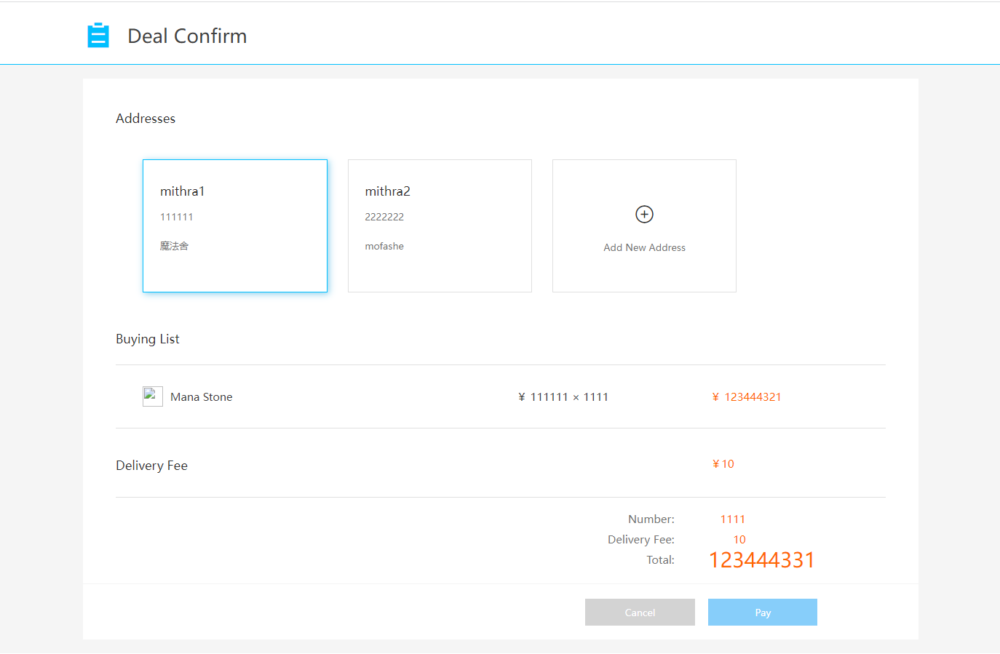

9. 商品发布界面（施工中）
- 前端：/publish
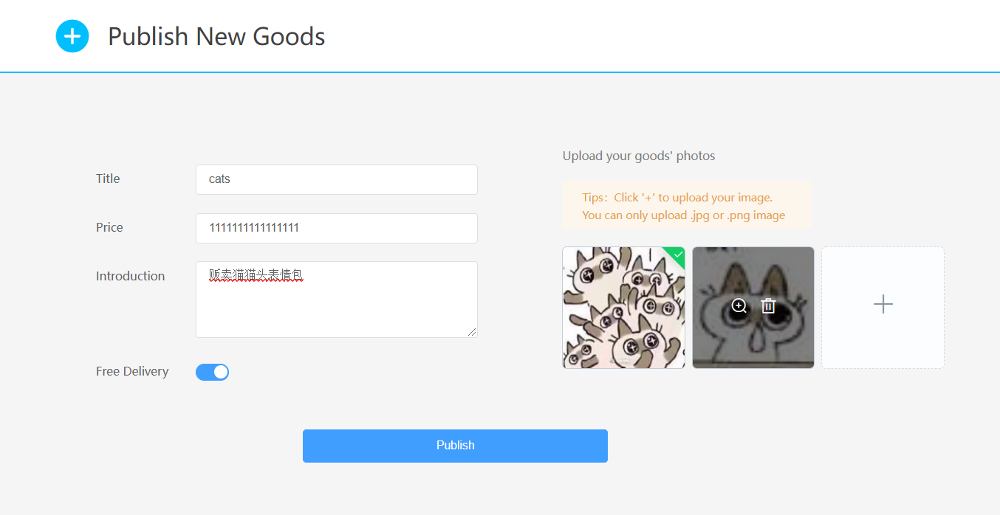
点击'+'添加商品图片

